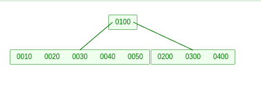
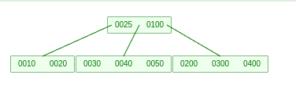
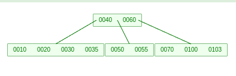
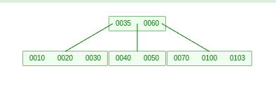
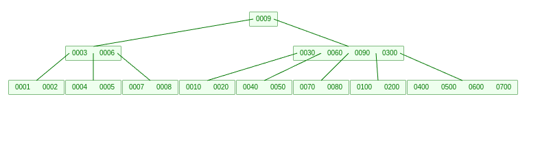
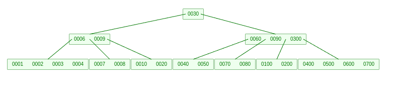

# B-Árvores: Estrutura de Dados e Funcionamento

## Introdução

A **B-Árvore** é uma estrutura de dados balanceada usada para organizar dados de forma eficiente em sistemas de armazenamento, como bancos de dados e sistemas de arquivos. Ela permite buscas, inserções e remoções de forma eficiente, minimizando o número de acessos ao disco, o que é especialmente útil para sistemas de gerenciamento de grandes volumes de dados. As B-árvores são uma generalização das árvores de busca binária, permitindo múltiplos filhos por nó.

## Estrutura das B-Árvores

Uma B-árvore é composta por nós que armazenam chaves e ponteiros para seus filhos. A principal característica das B-árvores é o seu balanceamento automático. Cada nó possui um número variável de filhos, dependendo de um parâmetro chamado **grau mínimo (t)**.

### Atributos dos Nós

Cada nó de uma B-árvore contém:

- **Node.n**: O número de chaves armazenadas no nó (no mínimo t-1 e no máximo 2t-1).
- **Node.chave1, Node.chave2, ..., Node.chavex.n**: As chaves armazenadas no nó, dispostas em ordem crescente.
- **Node.folha**: Um valor booleano que indica se o nó é folha (não tem filhos).
- **Node.c1, Node.c2, ..., Node.c Node.n + 1**: Ponteiros para os filhos do nó. Quando o nó é folha, não há ponteiros filhos.

### Grau Mínimo (t)

O **grau mínimo** de uma B-árvore (denotado por t) é um parâmetro crucial, que define o número mínimo de chaves que um nó pode armazenar. Um nó pode armazenar entre **t-1 e 2t-1 chaves**, e o grau mínimo também afeta a altura da árvore e o número de filhos que um nó pode ter.

- Para um nó interno de grau mínimo t: 
  - **mínimo de chaves**: t-1 
  - **máximo de chaves**: 2t-1
  - **mínimo de filhos**: t
  - **máximo de filhos**: 2t

A raiz pode ter apenas uma chave, enquanto os outros nós têm pelo menos t-1 chaves.

## Propriedades Importantes

- **Balanceamento**: A árvore mantém um balanceamento automático. Todos os caminhos da raiz até as folhas têm a mesma altura, o que garante que as operações de busca, inserção e remoção sejam realizadas em tempo logarítmico.
  
- **Busca Eficiente**: O tempo de busca em uma B-árvore é proporcional ao número de níveis da árvore, ou seja, a altura da árvore. Como a árvore é balanceada, o número de níveis é mantido pequeno, garantindo uma busca eficiente.

### Fórmula da Altura de uma B-Árvore

A altura de uma B-árvore de grau mínimo t e n chaves pode ser estimada como:

\[
h = O(\log_t n)
\]

Isso significa que a altura cresce muito lentamente à medida que o número de chaves aumenta, o que torna as operações de busca muito eficientes.

## Operações em B-Árvores

### Busca (B-TREE-SEARCH)

A operação de busca percorre a árvore da raiz até as folhas, buscando por uma chave específica. Em cada nó, a busca compara a chave desejada com as chaves armazenadas e decide qual filho seguir.

- **Busca em um nó**: A busca em cada nó é realizada de forma linear (ou binária, para otimização).
- **Busca total**: A busca ocorre em tempo \( O(h) \), onde h é a altura da árvore. Como a altura é logarítmica, a busca é eficiente, mesmo para grandes volumes de dados.

### Inserção (B-TREE-INSERT)

A inserção em uma B-árvore ocorre da seguinte forma:

1. **Descida até o nó folha**: A inserção em uma B-árvore começa com a **descida até o nó folha** onde a chave será inserida. A ideia é encontrar o local apropriado para a nova chave, mantendo a propriedade de ordenação dos nós.

#### Passos do processo:
- **Início pela raiz**: A busca começa na raiz da árvore.
- **Comparação das chaves**: A chave a ser inserida é comparada com as chaves nos nós. Dependendo da chave, o algoritmo decide qual ponteiro filho seguir.
  - Se a chave a ser inserida for menor que a primeira chave de um nó, segue-se o primeiro ponteiro filho.
  - Se for maior que a primeira chave, mas menor que a segunda, segue-se o segundo ponteiro filho, e assim por diante.
- **Continuação até um nó folha**: Esse processo de comparação e descida é repetido até se chegar a um **nó folha**, onde a chave será inserida.

A descida até o nó folha garante que a árvore se mantém balanceada durante a inserção, já que estamos sempre navegando por um caminho específico para a chave desejada.

#### Exemplo:
Em uma árvore com os nós [10, 20, 30] e [40, 50, 60], ao tentar inserir a chave 25, o algoritmo começa pela raiz e segue o ponteiro para o nó [20, 30], pois 25 está entre 20 e 30. O próximo passo é inserir a chave 25 nesse nó folha.

---
2. **Divisão de nós**: Quando o **nó folha** é encontrado, a próxima etapa é inserir a chave no local apropriado dentro do nó. A chave deve ser inserida de forma que as chaves dentro do nó permaneçam ordenadas.

#### Passos do processo:
- **Posicionamento da chave**: A chave a ser inserida é colocada na posição correta no nó, mantendo a ordem crescente das chaves dentro dele.
- **Verificação do espaço**: Se o nó tiver espaço suficiente (menos que 2t-1 chaves, onde t é o grau mínimo da árvore), a inserção é concluída aqui. Não é necessário fazer mais alterações.

A operação de inserção é simples quando o nó tem espaço suficiente para a nova chave. Nesse caso, a complexidade da operação é \( O(h) \), onde \( h \) é a altura da árvore, pois a operação de descida até o nó folha leva tempo logarítmico.

#### Exemplo:
Em um nó [10, 20, 30], se quisermos inserir a chave 25, a chave será colocada entre 20 e 30, resultando no nó [10, 20, 25, 30].

---
3. **Divisão recursiva**: Se o nó folha já estiver **cheio** (contendo 2t-1 chaves), ele precisa ser **dividido** para acomodar a nova chave. Esse é o processo mais complexo da inserção em B-árvores e garante que a árvore permaneça balanceada.

#### Passos do processo:
- **Divisão do nó**: Quando um nó folha está cheio e uma nova chave precisa ser inserida, o nó é dividido em dois nós. O nó é dividido ao meio, e a chave do meio é **promovida** para o nó pai.
  - O nó original será dividido em dois, cada um contendo \( t-1 \) chaves.
  - A chave mediana do nó será promovida ao nó pai, e essa chave divide os dois novos nós criados.
  
- **Ajuste no nó pai**: A chave promovida ao nó pai pode causar um **desbalanceamento** no nó pai, fazendo com que ele também precise ser dividido. Se o nó pai também estiver cheio, o processo de divisão será recursivo, propagando-se para cima da árvore.

Esse processo de divisão e promoção de chaves pode se repetir até que a raiz da árvore seja dividida, aumentando a altura da árvore.

#### Exemplo:
Suponha que temos um nó folha com as chaves [10, 20, 30, 40, 50]. 

Se a chave 25 for inserida, o nó será dividido em dois nós:
- Nó 1: [10, 20]
- Nó 2: [30, 40, 50]

A chave mediana (25) será promovida para o nó pai. Se o nó pai também estiver cheio, o processo se repete até que a árvore seja ajustada.

---

### Remoção (B-TREE-DELETE)

A remoção de uma chave em uma B-árvore é mais complexa, pois pode exigir ajustes nos nós para garantir que as propriedades da árvore sejam mantidas:

1. **Remover de um nó folha**:Quando a chave a ser removida está localizada em um **nó folha**, o processo de remoção é relativamente simples. O nó folha já é uma folha da árvore, ou seja, não possui filhos, o que significa que a remoção da chave não afetará o balanceamento da árvore de maneira significativa.

#### Passos do processo:
- **Identificação da chave**: O algoritmo começa percorrendo a árvore até o nó folha que contém a chave a ser removida.
- **Remoção direta**: Uma vez que o nó folha é encontrado, a chave é simplesmente removida da lista de chaves armazenadas nesse nó. Após a remoção, o número de chaves no nó é reduzido.

Este processo é simples e rápido, com complexidade de tempo \( O(h) \), onde \( h \) é a altura da árvore, pois a operação envolve apenas uma descida até o nó folha e a remoção da chave.

#### Exemplo:
Se um nó folha contém as chaves `[10, 20, 30]` e a chave 20 deve ser removida, o nó se tornará `[10, 30]` após a remoção. Nenhuma reorganização dos nós é necessária.

---

2. **Balanceamento**: Após a remoção de uma chave, o número de chaves no nó pode cair abaixo do **mínimo permitido** (t-1 chaves para nós internos). Isso pode violar a propriedade de balanceamento da B-árvore, que exige que cada nó tenha pelo menos t-1 chaves. Para garantir que a árvore continue balanceada, é necessário realizar ajustes no nó ou em seus vizinhos.

#### Possíveis soluções de balanceamento:
- **Emprestar uma chave do irmão adjacente**: Se o nó possui um irmão adjacente (esquerda ou direita) que possui mais do que o número mínimo de chaves (ou seja, mais de t-1 chaves), uma chave pode ser emprestada desse irmão. A chave emprestada será movida para o nó que perdeu a chave, e uma chave do pai será movida para o irmão.

#### Exemplo:
Temos os nós folhas `[10, 20, 30, 35]`, `[50 ,55]`, `[70, 100, 103]` e o nó pai `[40, 60]`. 

Ao remover a chave 55 teremos nós folhas `[10, 20, 30]`, `[40, 50]`, `[70, 100, 103]` e o nó pai `[35, 60]`.

  
- **Combinando dois nós**: Caso os irmãos adjacentes também tenham apenas t-1 chaves, o nó será combinado com um dos irmãos. Isso ocorre da seguinte maneira:
  1. O nó que perdeu a chave se funde com seu irmão adjacente.
  2. A chave do nó pai, que separa os dois filhos, é promovida para dentro do nó recém-combinado.
  3. Se o nó pai também estiver com o número de chaves abaixo do mínimo, o processo de balanceamento é recursivo e se propaga para cima na árvore.

Essas operações garantem que a árvore permaneça balanceada após a remoção, mantendo a propriedade de que todos os nós internos têm entre t-1 e 2t-1 chaves, e a altura da árvore é minimizada.

#### Exemplo: 
Ao remover a chave 5 o nó `[1, 2]` se une com a chave 4, a chave 3 do nó pai que separava os dois nós se une ao novo nó formado, mas o pai fere o número de chaves mínimas e o processo é repetido recursivamente juntando `[6]` com a chave 30 o nó `[9]` se junta e a chave 30 assume a posição de nó pai.

---

3. **Propagação do Balanceamento**:Se, após o balanceamento de um nó, o nó pai também ficar abaixo do número mínimo de chaves (t-1), o processo de balanceamento pode precisar se propagar para cima da árvore. Isso ocorre porque a remoção de uma chave pode afetar o número de chaves do nó pai, especialmente quando uma chave foi promovida do nó filho para o pai, ou quando um nó é combinado com seu irmão.

#### Processo de propagação:
- **Rebalanceamento no nó pai**: Se o nó pai perder uma chave ao promover uma chave para o nó anterior, ele pode precisar de mais balanceamento. Se o nó pai também tiver menos de t-1 chaves, o processo de balanceamento será repetido.
- **Cascata de divisões e combinações**: Se o balanceamento se propagar para cima e alcançar a raiz da árvore, ela também pode ser dividida ou combinada, o que pode até reduzir a altura da árvore.

Esses ajustes garantem que a B-árvore permaneça balanceada, com cada nó mantendo a quantidade de chaves dentro dos limites permitidos. Se necessário, uma nova raiz pode ser criada ou a altura da árvore pode ser reduzida.

#### Exemplo:
Suponha que a remoção de uma chave de um nó folha tenha causado um desequilíbrio no nó pai. Se o nó pai tiver agora t-1 chaves, ele pode pegar uma chave de um irmão ou se combinar com ele. Se isso ocorrer, e o pai também ficar desequilibrado, o processo de balanceamento se propaga até a raiz, ajustando a estrutura conforme necessário.
### Criação de uma B-Árvore (B-TREE-CREATE)

A criação de uma B-árvore começa com a inicialização de uma árvore vazia e a inserção das chaves, uma a uma, usando a operação de inserção mencionada.

## Vantagens das B-Árvores

- **Eficiência em Dispositivos de Armazenamento Secundário**: O principal benefício das B-árvores é a redução dos acessos a disco. Como os nós podem armazenar muitas chaves e o número de níveis da árvore é pequeno, as operações de E/S são otimizadas.
- **Balanceamento Garantido**: A árvore mantém seu balanceamento automaticamente, o que garante operações rápidas mesmo com grandes volumes de dados.
- **Desempenho em Consultas**: A busca, inserção e remoção em uma B-árvore são feitas em tempo logarítmico, o que é muito eficiente para grandes bases de dados.

## Eficiência das Operações em B-Árvores

As operações em uma B-árvore são altamente eficientes, com um desempenho que depende diretamente da altura da árvore. Como as B-árvores são balanceadas, a altura é mantida pequena mesmo com grandes volumes de dados.

- **Busca**: O tempo de busca é \( O(h) \), onde h é a altura da árvore. Como a altura cresce logaritmicamente com o número de chaves (h = \( O(\log_t n) \)), a busca em uma B-árvore é muito eficiente, mesmo para grandes bases de dados.
  
- **Inserção**: A inserção também tem um tempo de execução \( O(h) \). A complexidade da operação é limitada pela necessidade de descer até o nó folha e, possivelmente, dividir nós, o que ocorre em tempo logarítmico.

- **Remoção**: A remoção tem uma complexidade similar à da inserção, ou seja, \( O(h) \). A remoção pode envolver a reorganização de nós, o que pode exigir operações adicionais, mas a árvore ainda mantém um bom desempenho graças ao balanceamento.

## Aplicações das B-Árvores

- **Sistemas de Banco de Dados**: B-árvores são amplamente usadas em índices de bancos de dados, onde a eficiência de busca e inserção é crucial.
- **Sistemas de Arquivos**: Usadas para gerenciar arquivos e diretórios em sistemas de arquivos, onde o armazenamento e recuperação de dados devem ser rápidos e eficientes.
- **Sistemas de Gerenciamento de Dados**: Elas são usadas para armazenar dados indexados em dispositivos de armazenamento de grande capacidade.

## Variações das B-Árvores

- **B+ Árvore**: Uma variação da B-árvore onde todos os dados são armazenados nas folhas, enquanto os nós internos armazenam apenas chaves e ponteiros para os filhos. Isso aumenta a eficiência da busca e das operações de iteração.
- **B* Árvore**: Uma versão aprimorada da B-árvore que possui uma regra adicional de balanceamento, onde os nós internos têm mais chaves, o que melhora o desempenho em algumas operações.

## Conclusão

As B-árvores são fundamentais para o gerenciamento eficiente de grandes volumes de dados, especialmente em sistemas que exigem acesso rápido a informações armazenadas em dispositivos de armazenamento secundário. Sua estrutura balanceada, juntamente com o uso eficiente dos recursos de disco, garante que operações como busca, inserção e remoção sejam realizadas de forma otimizada.

## Referências

- [Vídeo: B-Tree](https://www.youtube.com/watch?v=K1a2Bk8NrYQ&pp=ygUFQnRyZWU%3D) - Canal de Algoritmos.
- **Livro**: Cormen, T. H., Leiserson, C. E., Rivest, R. L., & Stein, C. (2009). **Algoritmos: Teoria e Prática**. Capítulo 18.
