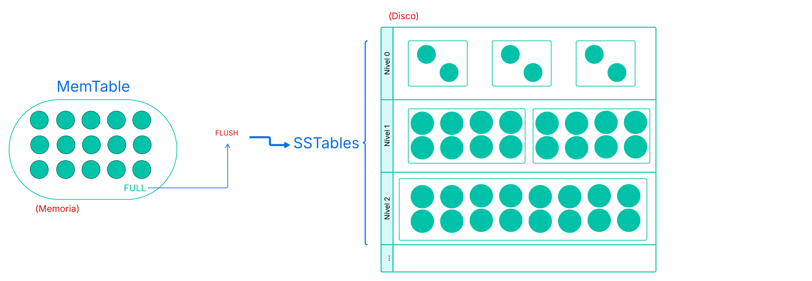
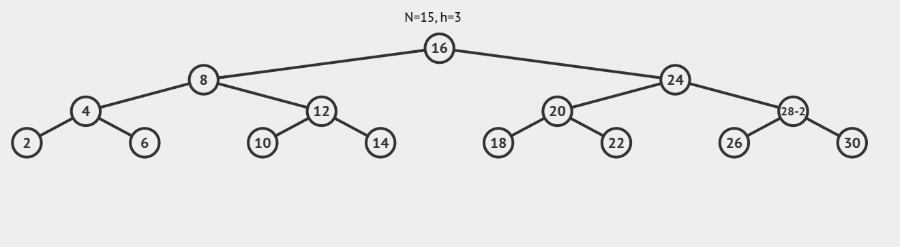
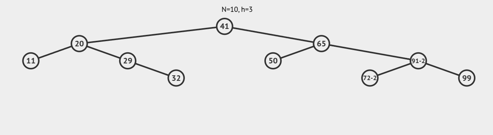
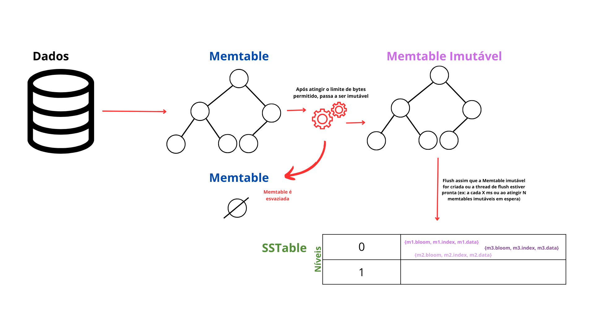
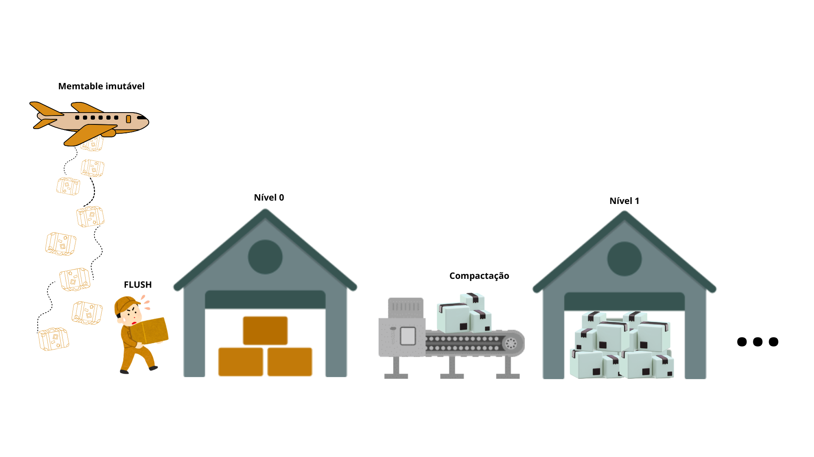

## LSM Tree

A LSM Tree, ou Árvore de Mesclagem Baseada em Log, é uma estrutura de dados bastante utilizada em sistemas de arquivos e bancos de dados. Sua principal vantagem está no desempenho eficiente para operações de escrita. Devido a essa característica, é comumente adotada por bancos de dados NoSQL, como o Cassandra, SyllaDB e RocksDB.

### Por que LSM Tree?
O PostgreSQL, por exemplo, utiliza B-Trees como estrutura padrão para armazenamento e busca de dados, com operações em tempo O(log n). Apesar de eficientes para leitura e escrita, as B-Trees enfrentam um problema chamado amplificação de escrita: uma única inserção pode exigir a atualização de várias páginas no disco, resultando em muitas operações de E/S aleatórias. Isso impacta negativamente o desempenho em cargas de escrita intensas.

Nesse cenário, surgem alternativas como a LSM-Tree, que minimizam esse custo ao otimizar o fluxo de inserção e reduzir o número de acessos diretos ao disco.

Um aspecto essencial dessa estrutura é a organização ordenada dos dados; na verdade, as chaves são mantidas em ordem tanto na memória principal quanto no armazenamento persistente, permitindo buscas eficientes com complexidade logarítmica.

---

Tudo bem, agora discutiremos como essa estrutura funciona e veremos a implementação em java baseada e inspirada na implementação e arquitetura de [Francesco Tomaselli](https://github.com/tomfran).
Inicialmente, é importante entender que uma árvore LSM é composta de dois componentes principais:



#### Memtable

A MemTable é uma estrutura de dados utilizada como área temporária na memória para armazenar informações antes que sejam persistidas no disco. Ela atua como um intermediário entre o sistema e o armazenamento permanente, permitindo que operações de leitura e escrita sejam realizadas de forma rápida, já que os dados permanecem em memória volátil.

Geralmente, a MemTable é implementada como uma árvore binária balanceada, o que assegura eficiência nas operações de inserção, remoção e busca. Esse balanceamento é fundamental para que a altura da árvore se mantenha proporcional ao logaritmo do número de elementos armazenados, ou seja, **O(log N)**, garantindo um bom desempenho mesmo com grandes volumes de dados.

Quando a MemTable atinge sua capacidade máxima, os dados nela contidos são **descarregados (ou "flushed") para o disco**, no formato de uma **SSTable (Sorted String Table)** — um tipo de armazenamento otimizado para leitura e escrita sequenciais.

Usamos árvore binária de busca balanceadas(AVL) na implementação. Ela têm essa cara:

|   |  |
|:----------------------------------------------------------:|:---------------------------------------------------:|
| Exemplo de AVL Perfeitamente Balanceada                   | Exemplo de AVL Balanceada                            |

Para nosso exemplo, teremos uma entidade Pessoa que representa de forma básica uma pessoa com nome, CPF, idade, telefone e data de nascimento. A AVLTree recebe um par <String, Pessoa>, em que a key é o CPF e o value é a instância do objeto Pessoa. Nesse caso, o Node armazena apenas o Value, pois a Function extrai a chave (CPF) a partir do valor armazenado (a instância de Pessoa).

Ao inserirmos uma instância de Pessoa na árvore AVL, o CPF é extraído automaticamente por meio da keyExtractor, permitindo que a árvore posicione o nó corretamente sem que o Node precise armazenar a chave separadamente, garantindo que a árvore permaneça balanceada. Além disso, caso uma Pessoa com o mesmo CPF já exista, a árvore irá atualizar os dados dessa Pessoa, mantendo a integridade da estrutura de dados e a ordem de inserção. A busca e remoção também funcionam de maneira similar, utilizando o CPF como chave para localizar a instância da Pessoa correspondente.

**Obs.:** A decisão pelo uso de keyExtractor se deu pela simplicidade que ele traz ao processo de inserção e pela capacidade de tornar a árvore mais genérica. Como a extração da chave (como o CPF) é uma operação direta e de baixo custo, o impacto no desempenho é praticamente nulo. Assim, a estrutura permanece eficiente e reutilizável para diversos tipos de dados, sem comprometer a performance.

Exemplo:
```java
AVLTree<String, Pessoa> avl = new AVLTree<>(Pessoa::getCpf);
avl.add(new Pessoa(...));
```

**Buscar na AVL é como procurar numa lista ordenada, mas muito mais rapidamente:**

- Começamos na raiz da árvore.

- Se o valor for menor que o nó atual, vamos para a esquerda.

- Se for maior, vamos para a direita.

- Repetimos esse processo até encontrar ou até chegar numa folha (nó sem filhos).

Como a árvore está sempre equilibrada, a quantidade de passos será próxima de log(n).

**Como funciona a inserção?**
- Buscamos o lugar certo para inserir, usando a mesma lógica da busca.
- Se já existe um nó com a mesma chave (ex: mesmo CPF), atualizamos o valor.
- Se não existir, criamos um novo nó e colocamos no lugar certo.
- Depois, verificamos se a árvore ficou desbalanceada.
- Se estiver, aplicamos rotações para equilibrar.

Exemplo: Se inserirmos vários dados seguidos para a direita, a árvore pode "pender" para um lado. A rotação corrige isso automaticamente.

A Memtable é a primeira parada dos dados em sistemas baseados em LSM-Trees. Ela armazena as informações na memória de forma organizada, facilitando tanto inserções quanto buscas. Mesmo sendo uma estrutura temporária, seu papel é essencial: manter os dados ordenados desde o início, o que é importante para garantir um bom desempenho nas próximas etapas.

Quando a Memtable enche, ela é "despejada" no disco, virando uma SSTable — um arquivo imutável, otimizado para leitura e gravação sequencial. Como os dados já estão ordenados na memória, esse processo de gravação no disco se torna muito mais eficiente.

No fim, a Memtable não é só um cache: ela é uma parte fundamental da estratégia de escrita das LSM-Trees, cuidando da organização, velocidade e preparação dos dados para o armazenamento permanente.

---

### SSTable

As SSTables (Sorted String Tables) são uma estrutura central no nosso modelo de armazenamento de dados. Elas representam arquivos imutáveis gravados em disco, contendo pares <chave, valor> ordenados pela chave. Por serem imutáveis, novas alterações de dados (como inserções, deleções ou atualizações) não modificam as SSTables existentes, mas geram novas versões, permitindo uma escrita eficiente em disco.

A SSTable é composta, na nossa implementação, por três arquivos principais:

`.data`: armazena os dados reais (<chave, valor>) em sequência ordenada.

`.index`: contém um índice esparso, que facilita buscas rápidas sem percorrer todo o arquivo.

`.bloom`: representa um filtro de Bloom, utilizado para descartar rapidamente chaves que com certeza não existem na tabela.

#### Criação
Basicamente, a criação de uma SSTable envolve a gravação dos pares no disco, gerando esses três arquivos citados. Durante esse processo, os elementos são lidos a partir de um iterador e armazenados sequencialmente no arquivo `.data`. Ao mesmo tempo, é construído um filtro de Bloom contendo todas as chaves presentes, o que permite otimizar futuras buscas, descartando rapidamente elementos inexistentes. Além disso, é formado um índice esparso para acelerar a localização de dados. Esse índice é baseado em amostras coletadas a cada `sampleSize` elementos. Para cada amostra, são registradas a chave, o deslocamento no arquivo (offset) e a posição no conjunto de dados, que posteriormente são gravados no arquivo `.index`. Ao final da escrita, o filtro de Bloom é persistido no arquivo `.bloom`. Caso o iterador fornecido esteja vazio, o processo é interrompido com uma exceção para evitar a criação de uma SSTable inválida e vazia.

#### Nível 0 e as Memtables Imutáveis
A criação de uma SSTable é diretamente desencadeada quando a Memtable atinge um limite de tamanho e se torna imutável. Essa Memtable imutável é então descarregada no disco como uma nova SSTable. Todas as SSTables recém-criadas são inicialmente armazenadas no `nível 0`, que é reservado para os dados mais recentes e ainda não compactados.

No **nível 0**, várias SSTables podem existir ao mesmo tempo, e é normal que elas tenham chaves repetidas entre si. Isso acontece porque cada SSTable é criada a partir de uma Memtable diferente, em momentos diferentes, e por isso não seguem uma ordem entre si.

No começo, isso não é um problema. Mas com o tempo, à medida que mais SSTables são criadas, essa sobreposição de chaves pode atrapalhar as buscas. Para resolver isso, o sistema faz a **compactação**: junta várias SSTables antigas, organiza os dados e move para níveis mais altos, onde as SSTables não têm chaves repetidas entre si. Assim, o sistema continua rápido e eficiente.

A principal vantagem das SSTables está na eficiência da leitura e escrita sequencial, ideal para discos magnéticos ou SSDs. Como os dados são ordenados e imutáveis, eles podem ser escritos uma única vez e lidos de forma otimizada, especialmente com o suporte de estruturas auxiliares como o índice esparso e o filtro de Bloom.

Abaixo segue uma representação simplória de como os dados chegam à SSTable.



---
Rapidamente, vamos entender melhor o `bloomFilter` e `índice esparso`:

>Um **Bloom Filter** é uma estrutura de dados probabilística usada para testar se um elemento possivelmente está presente em um conjunto. Ele pode dar falsos positivos, mas nunca falsos negativos.

**Como funciona:**
Quando inserimos uma chave (ex: CPF), ela é passada por várias funções hash.
Cada hash marca um ou mais bits como 1 em um vetor de bits.
Para verificar se uma chave existe, aplicamos os mesmos hashes e vemos se os bits estão marcados como 1.

Exemplo (conteúdo .bloom):
````
000101001010011010... (vetor de bits com os bits setados)
````
Usado para dizer "essa chave talvez esteja na SSTable" sem acessar o disco inteiro.

---
>O **índice esparso** guarda apenas algumas entradas da tabela (não todas), economizando espaço, e servindo como atalhos para busca.

**Como funciona:**

Ao escrever as chaves no disco, a cada N chaves (por exemplo, 1000), salvamos:

- O offset (posição no arquivo onde aquela chave começa),

- A chave,

- E a quantidade acumulada de registros até ali.

Com isso, na leitura, conseguimos fazer uma busca binária nesse índice menor e pular direto para a parte do arquivo onde provavelmente está a chave.

Exemplo (conteúdo .index):
```
204.756.938-92   → offset 4096   → posição 3000 da lista
```

---

Mais a diante, discutiremos o fluxo completo. A priori, o objetivo é entendermos o que é cada um desses componentes da **LSMTree**.

---

### Flush e Compactação

#### Flush

O **flush** acontece quando a estrutura em memória atinge sua capacidade máxima. Nesse ponto, os dados são transferidos para o disco de forma ordenada, liberando espaço na RAM para novas inserções. Essa transferência é eficiente justamente por aproveitar a ordenação prévia, permitindo gravações sequenciais rápidas.
Durante o flush, tombstones (valores especiais que indicam remoção lógica) também são persistidos. Eles não eliminam imediatamente os dados antigos, mas sinalizam que determinadas chaves devem ser ignoradas em leituras futuras.
Com o tempo, múltiplos arquivos no disco vão se acumulando. Para evitar degradação no desempenho das buscas e liberar espaço ocupado por dados obsoletos ou removidos, entra em cena a compactação. Ela realiza a fusão desses arquivos, removendo duplicações, aplicando os tombstones e reorganizando os dados em um novo arquivo mais enxuto e eficiente.

#### Compactação

A **compactação** é o processo responsável por manter a base de dados enxuta e eficiente ao longo do tempo. Ela ocorre periodicamente ou sob determinadas condições, como excesso de arquivos ou volume elevado de tombstones.

Durante a compactação, os arquivos persistidos são lidos e mesclados em um novo arquivo ordenado. Nessa etapa:
- Chaves duplicadas são unificadas, preservando apenas a versão mais recente.
- Tombstones são aplicados: chaves marcadas como removidas são efetivamente descartadas.
- Os dados são regravados em um novo arquivo, enquanto os antigos são descartados.

Esse processo reduz a fragmentação, melhora o desempenho de leitura e libera espaço em disco. Além disso, como a compactação pode ser feita em diferentes níveis (por exemplo, *minor* envolvendo poucos arquivos ou *major* envolvendo todos os arquivos de um nível), é possível balancear custo e benefício conforme a carga de trabalho do sistema.

#### Estratégia Baseada em Inspeção Temporizada para Flush e Compactação
Na arquitetura da LSM-Tree, tanto o flush da Memtable quanto a compactação entre níveis são operações essenciais para manter a estrutura eficiente, organizada e rápida em operações de leitura e escrita.

Embora seja possível realizar essas operações com base em limites de tamanho ou quantidade de dados (por exemplo, ao ultrapassar o número máximo de SSTables no nível 0 ou o tamanho total em bytes), optamos por uma estratégia baseada em inspeções periódicas(mantendo a estratégia de Francesco). Isso significa que o sistema verifica de tempos em tempos — em intervalos definidos — se é necessário realizar o flush ou iniciar uma nova compaction.

Isso porque, ao realizar testes com cargas razoavelmente grandes (a partir de 10.000 registros), observamos que a estratégia baseada em verificação por tamanho apresentava um leve impacto negativo no tempo de execução. Embora essa diferença de desempenho não tenha sido drástica, a abordagem com inspeção temporizada se mostrou mais eficiente e estável para o nosso cenário. Ela permite que o sistema mantenha sua performance mesmo sob variações de carga, evitando pausas ou gargalos causados por verificações frequentes baseadas em tamanho ou quantidade de SSTables.

Analogamente:



---

Na prática, no nosso exemplo, quando a LSMTree adicionar os elementos, eles serão adicionados como um par chave-valor em que ambos são uma `byte[]`:
```java
[LSMTree]

public void add(K key, V value) throws JsonProcessingException {
    synchronized (mutableMemtableLock) {
        mutableMemtable.add(new ByteArrayPair(conversorToByte(key), conversorToByte(value)));
        checkMemtableSize();
    }
}
```
Memtable recebe esse `ByteArrayPair` e adiciona à AVLTree:
```java
[Memtable]

private AVLTree<ByteArrayWrapper, ByteArrayPair> tree;

public Memtable() {
    tree = new AVLTree<>(ByteArrayPair::getKey); // indica como pegar a chave
}

public void add(ByteArrayPair item) {
    tree.add(item);
    byteSize += item.size();
}
```
--
Vale destacar que, em LSM-Trees, a remoção é tratada como uma nova inserção: adiciona-se um valor especial conhecido como `TOMBSTONE` (um marcador de exclusão), associado à chave correspondente. Isso indica que o valor foi deletado, mesmo antes da persistência no disco.
```java
[Memtable]

public void remove(byte[] key) {
    tree.add(new ByteArrayPair(key, new byte[]{}));
}
```
Se a chave a ser removida já estiver presente na **Memtable mutável**, seu valor é simplesmente substituído por um `tombstone` (por exemplo, um `byte[]` vazio).

No entanto, caso a chave não esteja na **Memtable mutável**, não podemos alterar diretamente as SSTables (que já estão persistidas no disco e são imutáveis). Por isso, adicionamos uma nova entrada na Memtable com a mesma chave e um valor especial indicando exclusão (`tombstone`).

Esse `tombstone` garante que, durante futuras leituras ou operações de compactação, a chave seja tratada como removida, mesmo que versões anteriores ainda existam em SSTables mais antigas.
