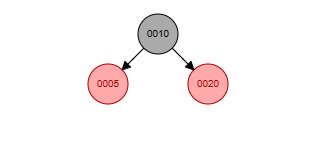
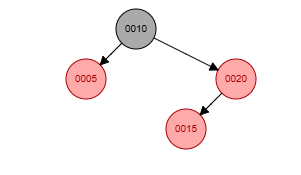
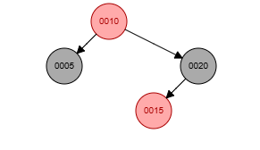
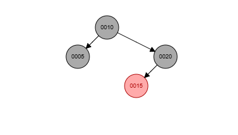
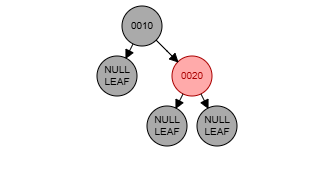
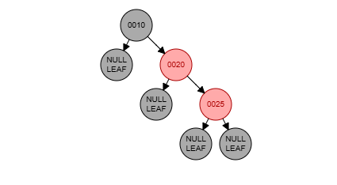
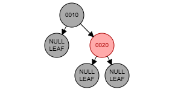
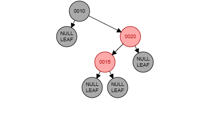
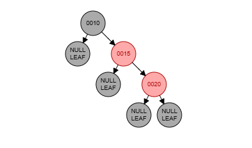
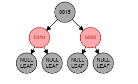

# TreeMap

A classe `TreeMap<K extends Comparable<K>, V>` é uma implementação de uma árvore binária de busca balanceada, mais especificamente uma **árvore Rubro-Negra**, onde as chaves são mantidas em ordem crescente. O balanceamento é garantido através de restrições adicionais, assegurando que operações como inserção, remoção e busca sejam eficientes.

## Estrutura Interna

### Nós da Árvore (`Node`)
Cada nó contém três informações principais:
- **`key`**: A chave associada ao nó, do tipo genérico `K` (que deve ser comparável, por isso `K extends Comparable<K>`).
- **`value`**: O valor associado à chave.
- **`color`**: A cor do nó (vermelho ou preto), crucial para manter o balanceamento da árvore.

### Raiz da Árvore (`root`)
- A árvore mantém uma referência à sua raiz (`root`).
- O número de elementos é monitorado pela variável `size`.

## Propriedades da Árvore Rubro-Negra
Para garantir o balanceamento, a árvore segue estas regras:
1. **Cor do nó**: Cada nó é **vermelho** ou **preto**.
2. **Raiz preta**: A raiz é sempre **preta**.
3. **Nós vermelhos consecutivos**: Nós vermelhos não podem ter filhos vermelhos (não há dois nós vermelhos consecutivos em nenhum caminho).
4. **Caminhos com mesma quantidade de nós pretos**: Todos os caminhos da raiz até as folhas (ou nós nulos) devem ter o mesmo número de nós pretos.
5. **Inserção de novos nós**: Novos nós são sempre inseridos como **vermelhos** e, se necessário, a árvore é rebalanceada.

##  Operações Principais

### 🔹 Inserção (`put`)
- Se a chave já existe, apenas o valor é atualizado.
- Caso contrário, um novo nó é inserido como vermelho.
- Após a inserção, a árvore é balanceada (se necessário) usando **rotações** (`rotateLeft`, `rotateRight`) e **troca de cores** (`flipColors`).

**Casos** de inserção que podem ou não precisar de rebalanceamento:

1. O nó inserido é a raiz
    - Solução: Pintar o nó de preto, pois a raiz sempre deve ser preta.
   
2. O pai do nó inserido é preto
    - Não há violação, á árvore continua válida, uma vez que todo novo nó é vermelho
   
3. O pai e o tio são vermelhos
    - Solução: recolore o pai e o tio para preto e o avô para vermelho e verifica se o avô começou a ferir alguma regra.
      #### Exemplo:
      Situação: Inserir 15 numa árvore com raiz 10 e filhos 5 e 20(vermelhos).
   
      
   
      Passo 1: Inserir o 15
   
      
   
      Passo 2: Pai(20) e tio(5) são vermelhos. Recolore
   
      
   
      Passo 3: Como a raiz está vermelha recolore
   
      
   
4. O pai é vermelho e o tio é preto (temos dois subcasos nessa situação)

    * Configuração LL ou RR (nó inserido, nó pai e nó avô estão alinhados) - primeira letra se refere a posição do pai em relação ao avô e a segunda ao nó inserido em relação ao pai.
        - Solução: Rotação simples(para direita ou para esquerda) no nó avô + troca de cores entre pai e avô.
          #### Exemplo:
          Situação RR: Inserir 25 numa árvore com raiz 10 e filho 20
      
          
      
          Passo 1: Inserir 25
      
          
      
          Passo 2: Rotação à esquerda no avô(10) e troca de cor entre pai(20) e avô(10) 
      
            

    * Configuração LR ou RL (nó inserido está desalinhado)
        - Solução: rotação dupla (rotação no pai + rotação no avô) + ajuste de cores.
          #### Exemplo:
      
          Situação LR: Inserir 15 numa árvore com raiz 10 e filho 20
      
          
      
          Passo 1: Inserir 15
      
          
      
          Passo 2: Rotação à direita no pai(20)
      
          
      
          Passo 3: Rotação à esquerda no avô(10) e ajuste de cores 15 torna-se preto, 10 e 20 vermelhos
      
          
      
### 🔹 Busca (`get`)
- A busca segue as comparações padrão de uma árvore binária de busca.
- Retorna o valor associado à chave ou `null` se a chave não existir.

### 🔹 Remoção (`delete`)
- Remove um nó e rebalanceia a árvore para manter as propriedades Rubro-Negras.
- Envolve substituições de nós e ajustes de cores.

* A remoção se torna mais coplexa quando removemos um nó preto, pois ele pode causar um desiquilibrio na altura preta da árvore, os casos de correção são:

    1. O irmão do nó removido é vermelho
        - Solução: Rotaciona o pai, troca as cores do pai e do irmão e trata o problema novamente.
    2. O irmão do nó removido é preto e ambos os seus filhos são pretos
        - Solução: Recolore o irmão para vermelho e propaga o problema para cima (para o pai do nó removido).
    3. Irmão é preto, o filho mais próximo do irmão é vermelho, e o mais distante é preto
        - Solução: Rotaciona o irmão, troca as cores do irmão e do seu filho, e trata como o Caso 4.
    4. O irmão é preto e o filho mais distante do irmão é vermelho
        - Solução: Rotaciona o pai, ajusta as cores (pai e irmão trocam de cor, e o filho distante do irmão vira preto).

### 🔹 Verificação de Balanceamento (`isBalanced`)
- Verifica se todos os caminhos da raiz até as folhas têm o mesmo número de nós pretos.
- Retorna `true` se a árvore estiver balanceada.

### 🔹 Iteração (`keys`, `values`, `KeyIterator`)
- Permite percorrer as chaves e valores em **ordem crescente**.

## Métodos Auxiliares
- **`rotateLeft` / `rotateRight`**: Realizam rotações para corrigir desbalanceamentos.
- **`flipColors`**: Troca as cores dos nós para manter as propriedades da árvore.
- **`Ajustes de cores`**: Garantem que não haja dois nós vermelhos consecutivos.

## Benefícios
- **É uma estrutura de dados muito eficiênte**:
    - Inserção (`put`): **O(log N)**
    - Busca (`get`): **O(log N)**
    - Remoção (`delete`): **O(log N)**
- **Balanceamento automático**: A árvore se rebalanceia dinamicamente após inserções/remoções.

## Conclusão
A implementação do `TreeMap` usando uma **árvore Rubro-Negra** oferece um ótimo equilíbrio entre **eficiência** e **simplicidade**. É ideal para cenários onde é necessário:
- Manter chaves **ordenadas**.
- Garantir operações rápidas (**O(log N)**) mesmo com grandes volumes de dados.
- Evitar desbalanceamentos que degradariam o desempenho.

## Referências
- **Livro**: Cormen, T. H., Leiserson, C. E., Rivest, R. L., & Stein, C. (2009). **Algoritmos: Teoria e Prática**. Capítulo 13

---
